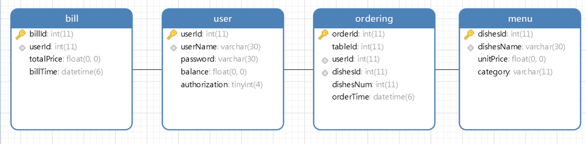
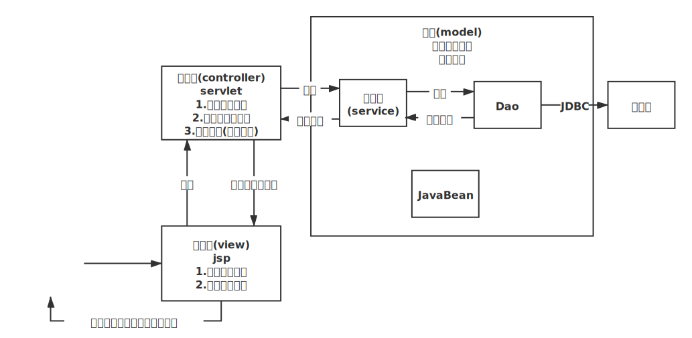
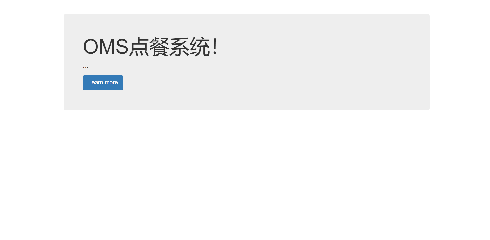
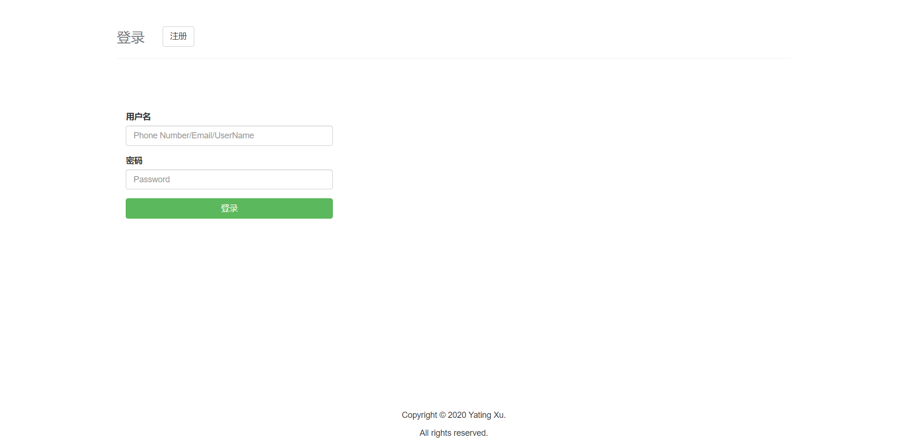
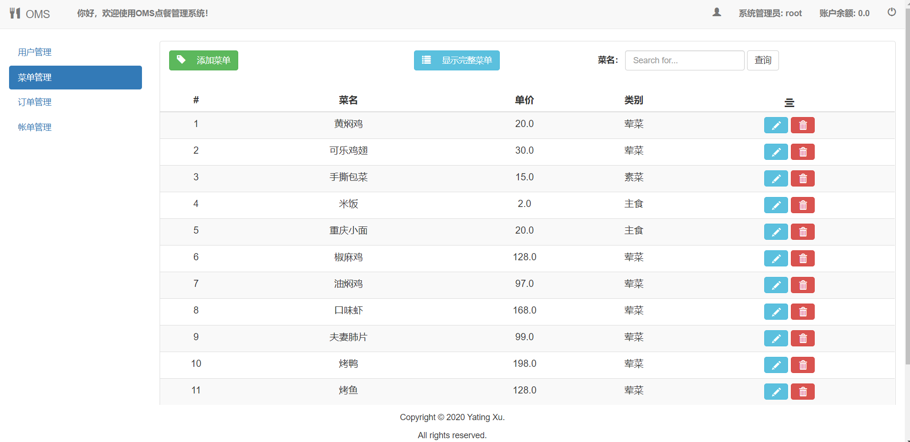

# OMS

## 一、使用方法

>  $ git clone https://github.com/xytroot/OMS.git

并在src/main/resources/db.properties文件中修改数据库连接信息

## 二、技术栈

项目管理：Maven

前端：bootstrap、jsp、ajax、JavaScript、jQuery

后端：SSM(Spring + SpringMVC + MyBatis)框架

## 三、开发环境

IDE：IntelliJ IDEA Ultimate 2020.2.2

操作系统：Windows 10 专业版

开发语言：Java

数据库：MySQL 5.7

数据库连接池：c3p0

服务器：Tomcat 9.0.39

## 四、数据库表结构

## 五、系统功能模块结构

使用MVC三层架构进行开发：

    

### 5.1 前端功能

**视图层(view)**：使用jsp开发

1. 展示数据模型

2. 提供用户操作

### 5.2 WEB服务端

**控制器(controller)**：servlet

1. 接收用户请求

2. 交给业务层处理

3. 视图跳转(携带数据)

 

**模型(model)**

1. 控制业务操作

2. 增删改查

### 5.3 数据库端

存储数据

## 六、界面

